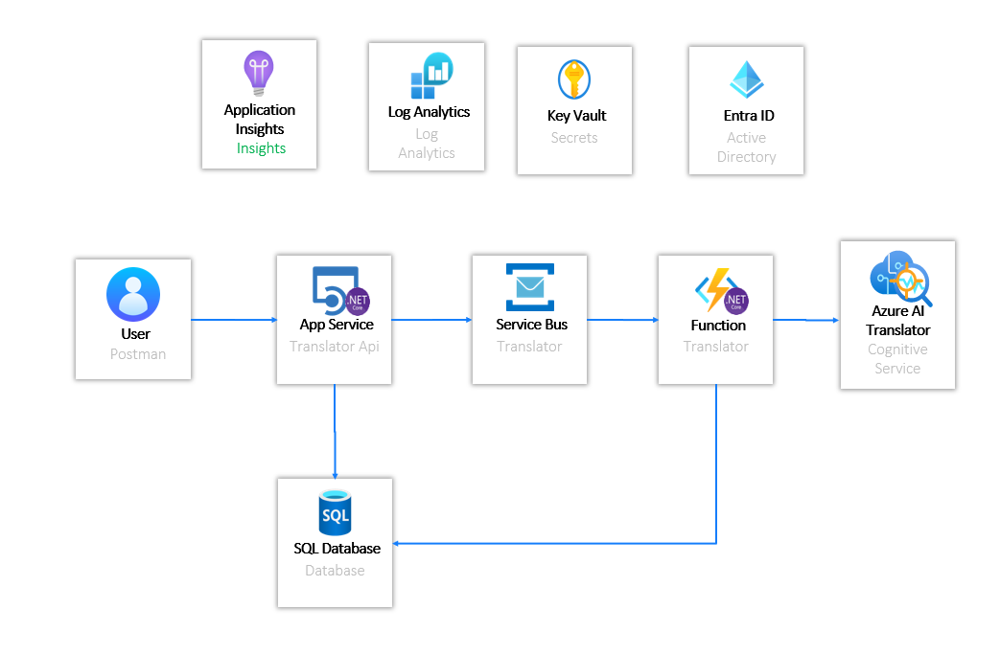

# Turing Challenge - Translator API

## Challenge
- Develop a solution in .NET Core to manage the translation of texts in an asynchronous way.
- The translation process expects a text in an unspecified language.
- Upon receiving this via an HTTP REST call to an API, the system will return a request identifier.
- The asynchronous translation process should detect the language and translate the text into English if necessary.
- To query the result, the API expects the request identifier returned in the initial query.

## Architecture

# Solution
The solution uses:
- Visual Studio 2022
- .NET 8
- Minimal API
- Clean Architecture

# Considerations
Since this is a demo, several considerations will be taken into account that affect both the architecture and the code, as well as the use of the API.

## Async Translation
One of the requirements is to translate the texts asynchronously. For this purpose, the most suitable approach is to use microservices that handle this task. The architecture shows an example using Service Bus and Azure Function. However, in this demo, we have chosen to use as few Azure services as possible, and therefore, this will be done within the API itself.

For this, a translation task is executed which is not expected. This task creates a Scope using IServiceFactory to obtain the database context and performs the translation process (calling the Azure AI Translator service) and updating the database state. This presents mainly two problems. The first is the use of a task that is not expected and therefore loses control within the main application. A possible solution would be to use [Hangfire](https://www.hangfire.io/). The other problem is creating a service using IServiceFactory, which is an anti-pattern.

As mentioned, it has been done this way to perform all the processes in the API, but in a real environment, a more suitable approach is the use of microservices.

## Secrets and Connection Strings
In a real environment, it is recommended to store the keys in a Key Vault. In this demo, the configuration section of the Web App is used to configure the connection strings.

Whenever keys are used, it is advisable to rotate them periodically. [A solution can be implemented to do this automatically](https://learn.microsoft.com/en-us/azure/key-vault/secrets/tutorial-rotation-dual?tabs=azure-cli). Configuring the keys in the Key Vault helps ensure that the services, when obtaining them, have an updated key. The use of two keys in the services (those that have this feature enabled) is very useful at the time of rotation, as it prevents a service from being inaccessible while the rotation is executed.

Additionally, whenever possible, it is advisable to use managed identity to connect the services.

## Storage
In this application, the user can obtain translations using an identifier. Therefore, these translations have to be stored somewhere. In this demo, an in-memory database is used. In a real solution, you could use, for example, a SQL database or a blob storage. Blob storage has the advantage of using automatic blob deletion policies.

## Azure AI Translator
Azure.AI.Translation.Text SDK has been used to translate the texts, but at the time of this demo, it is in prerelease.

## Authentication and Authorization
When authenticating and authorizing users, we use a JWT. The way to obtain this token is directly in the API by means of a user and password defined in the configuration. This is not the right way to generate it in a real environment, and we should use more robust solutions like Auth0, Microsoft EntraID, or Azure Active Directory B2C.

# Testing
The way to test it has been to deploy a web app and the translation service in Azure and use Postman to make the calls. When debugging, we used the Visual Studio 2022 Debugger.

This solution does not implement unit testing or integration; it is something to be done.
